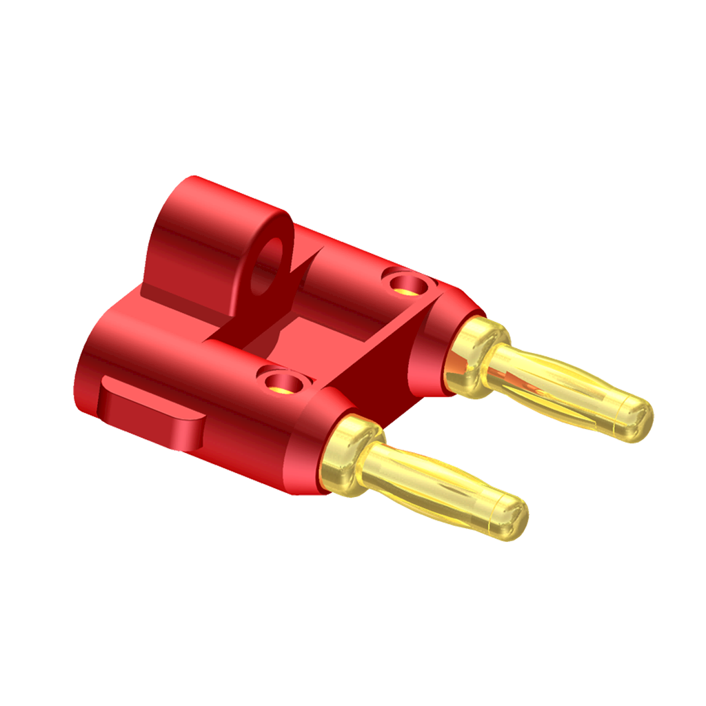

# [Recovery](https://github.com/sonicavionics/4in-recovery/)

---

The recovery module is responsible for checking continuity and controlling ejection charges for parachute deployment. It features a BMP388 barometric sensor that enables autonomous deployment decisions independent of the sensors module. This approach provides redundancy in critical scenarios, ensuring parachute deployment even if the sensors module fails.

---

    
    

3D Render

Schematic

    
    

Footprint

This board will be in charge of checking continuity, and arming the ejection charges. it will report on tall this over the CAN network. It will also have it's own barometer for independency. We will be able to turn on or off automatic ejection. If the rocket target altitude is lower than expected, 

There will be remove before flight tags in the form of banana connectors with a tag on it which will disarm the charges.

## Components

- 
- [Banana plug](https://www.digikey.ca/en/products/detail/mueller-electric-co/BU-PMDP-S-2/4073757)
- [Banana socket](https://www.digikey.ca/en/products/detail/pomona-electronics/2269-0/736335?s=N4IgjCBcoEwJxVAYygMwIYBsDOBTANCAPZQDaIAzACwBsVcA7CALqEAOALlCAMocBOASwB2AcxABfQmAAcFRCBSQMOAsTKUwDGTpbsukXgJHipIALQ0FSgQFc1JSORgsJZl05AAhAIIA5fx8AAgApHwBhAGk9EABWBTYoMHZEyBhYtyA) (order an extra 5/16-32 nut with this)
- [CAD model available here](https://www.3dcontentcentral.com/secure/download-model.aspx?catalogid=171&id=587137)
- [STEP file available here](https://www.3dcontentcentral.com/download-model.aspx?catalogid=171&id=626290)

- **MCU**

    - MCU [RP 2040](https://www.raspberrypi.com/products/rp2040/)

    - Flash [W25Q128JVP](https://www.winbond.com/hq/product/code-storage-flash-memory/serial-nor-flash/?__locale=en&partNo=W25Q128JV)

- **USB-C** [JLC USB-C port](https://jlcpcb.com/partdetail/ShouHan-TYPE_C_16PIN_2MD_073/C2765186)

- **Momentary Button** [TS-1187A-B-A-B](https://jlcpcb.com/partdetail/XkbConnectivity-TS_1187A_B_AB/C318884)

- **CAN Controller and transceiver** [MCP25625](https://jlcpcb.com/partdetail/MicrochipTech-MCP25625T_EML/C191253)

    - CAN chip crystal [X322516MLB4SI](https://www.lcsc.com/datasheet/lcsc_datasheet_2403291504_YXC-Crystal-Oscillators-X322516MLB4SI_C13738.pdf)

- **Quick Connectors** 
    - [Wago 2060-452](https://jlcpcb.com/partdetail/Wago-2060_452_998404/C2765055)

The above will disable a relay by shorting the enable pin.

