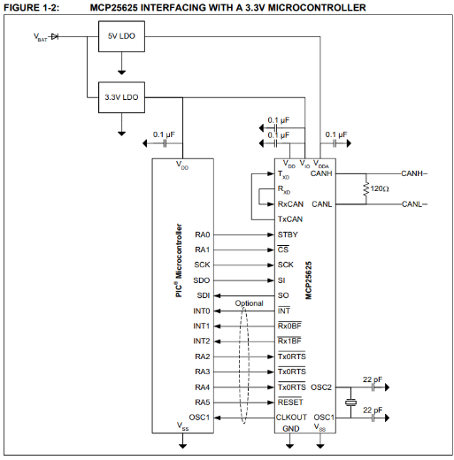

# Cihad's Status Module 

[Cihad's Status Module](https://github.com/sonicavionics/4in-cihadkhaled-statusmodule)

---

Cihad's prototype of the status module.

---

    
    

3D Render

Schematic

    
    

Footprint

<!-- # Components -->

<!-- - [Regulator](https://jlcpcb.com/partdetail/DiodesIncorporated-AP63203WU7/C780769)
- [Inductor](https://jlcpcb.com/partdetail/Tdk-SLF7055T_6R8N2R83PF/C21218)
- **USB-C** [JLC USB-C port](https://jlcpcb.com/partdetail/ShouHan-TYPE_C_16PIN_2MD_073/C2765186) -->

## CAN bus - MCP25625T-E/ML
- OSC1 & 2 are connected to capacitors and an oscillator crystal - X322516MLB4SI
- CLKOUT is NC because the RP2040 already has a clock signal
- TxCAN -> TxD (based on FIGURE 1-2)
- RxD -> RxCAN (based on FIGURE 1-2)

“The TXD and RXD pins of the CAN transceiver must be externally connected to the TxCAN and RxCAN pins of the CAN controller.” (Datasheet)

