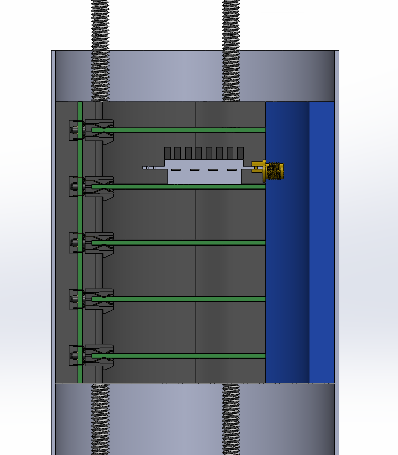

---
hide:
  - toc
---

# CAD

This is the page to describe the avionics bay CAD.

Version 1

Version 2

Version 2, Section View

There's just barely enough space to fit the RFD900x on a module. So why not?

[Here](../../../blog/posts/2024/december/7/7.md) is a blog post showing some other revisions.

## Rack

The rack will use [these threaded inserts](https://www.amazon.ca/gp/product/B0CNRSJ1B2?psc=1)