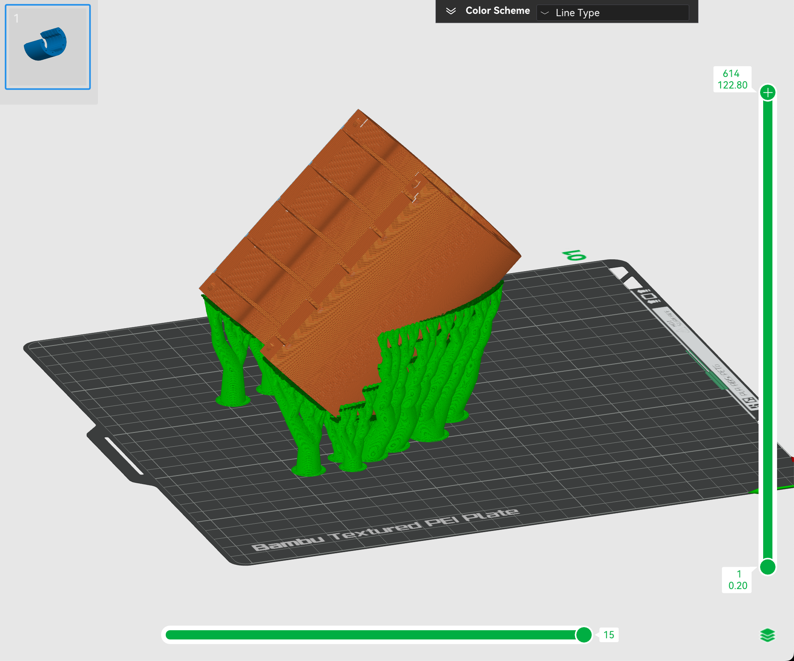

---
hide:
  - toc
---

# CAD

This is the page to describe the avionics bay CAD.

Version 0.2.0

There's just barely enough space to fit the RFD900 on a module. so why not?
The challenge is to see if these over hangs can print.

[Here](../blog/posts/2024/december/7/7.md) is a blog post showing some other revisions.

## Rack

The rack will use [these threaded inserts](https://www.amazon.ca/gp/product/B0CNRSJ1B2?psc=1)

### 3D printing

The rack had to be printed at a 45 degree angle.

Slicer Render
