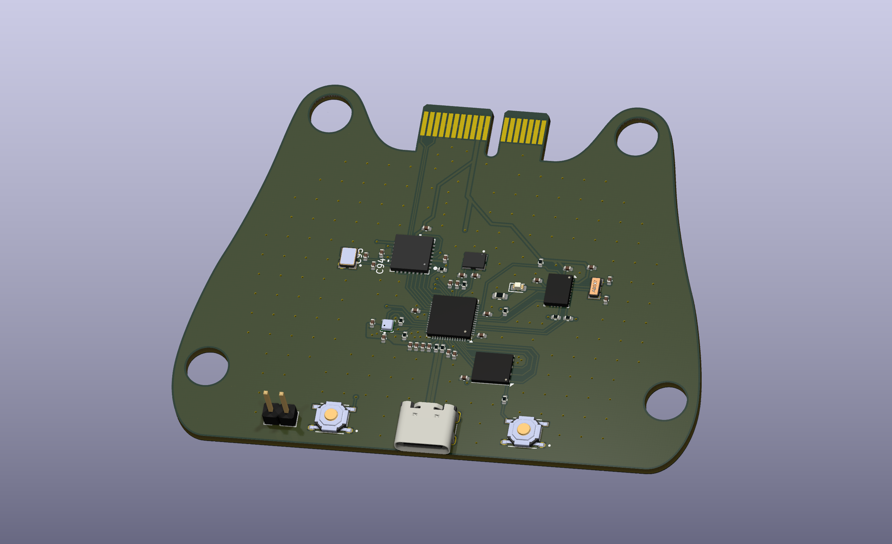
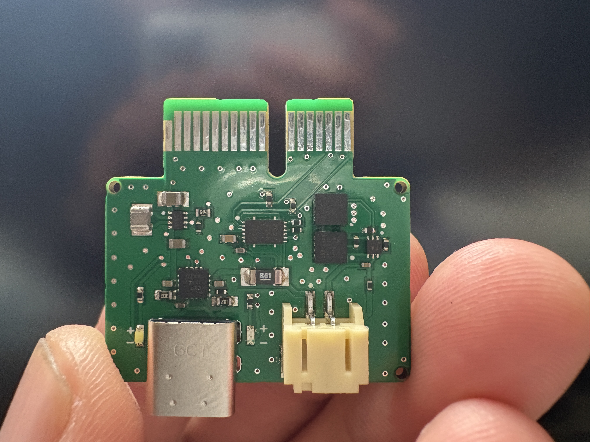
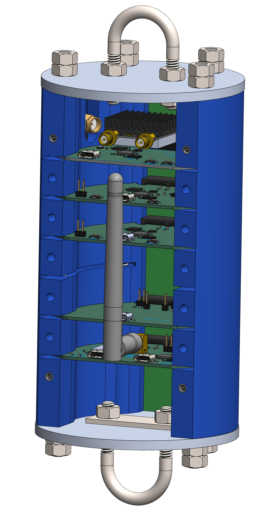
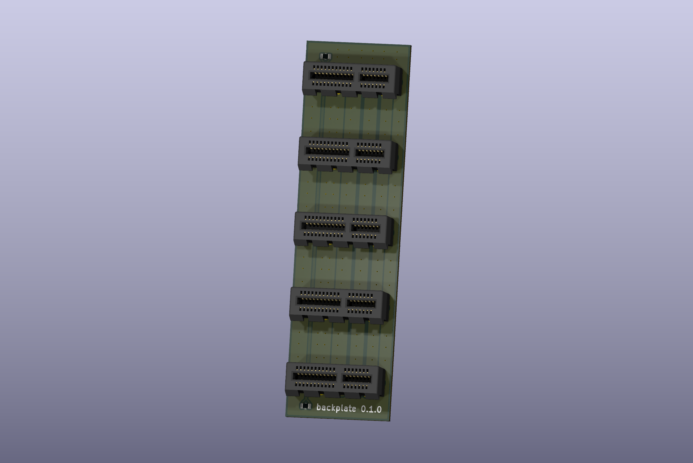
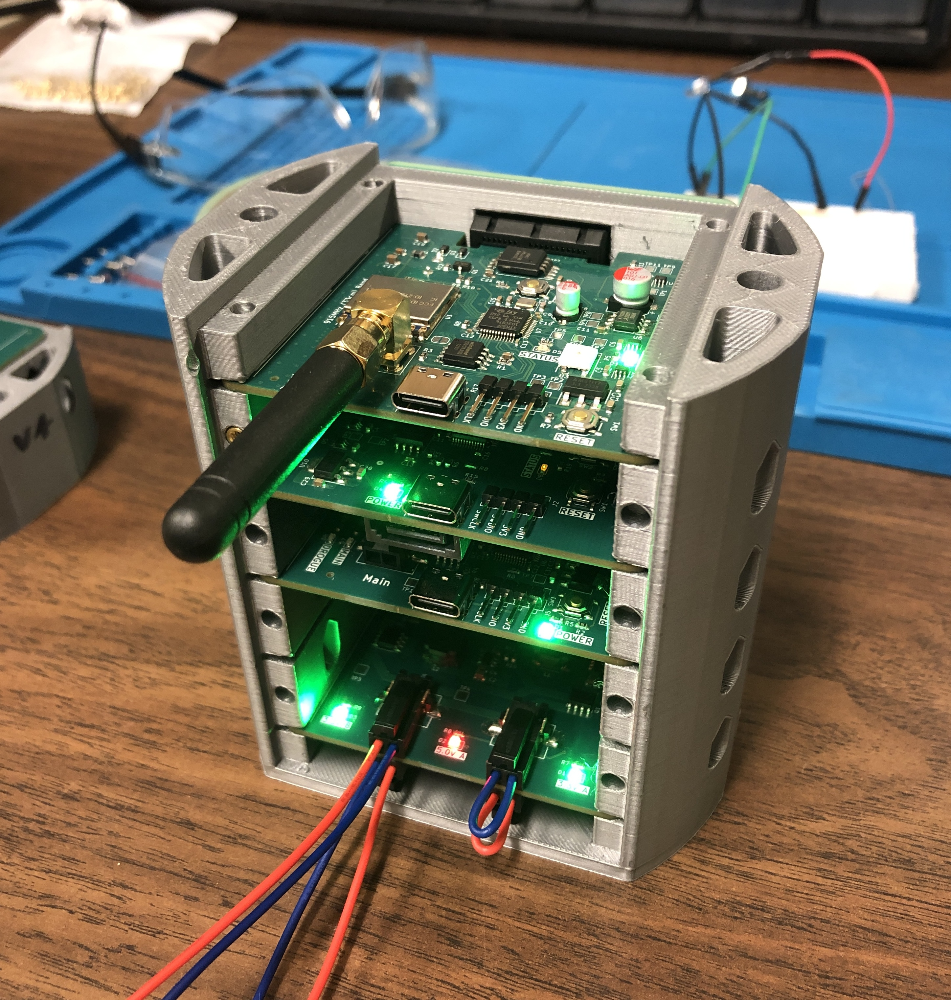

# 4" Avionics

Avionics for a 4 inch rocket

<figure markdown="span">
  { width="600" }
  <figcaption>January 2nd: Sensor Board 0.1.0</figcaption>
</figure>

<figure markdown="span">
  { width="600" }
  <figcaption>December 19st: Power Board 0.0.2</figcaption>
</figure>

<figure markdown="span">
  { width="600" }
  <figcaption>December 7th: Avionics bay 0.1.0</figcaption>
</figure>

<figure markdown="span">
  { width="600" }
  <figcaption>January 2nd: Backplate 0.1.0</figcaption>
</figure>

---

## Initial Requirements and Design Goals

The primary goal of the 4-inch avionics system is to enable personal learning. This will be the first board of many. It will be a CAN-enabled system in a 4-inch diameter form factor.

### Primary Functional Requirements

- Easy to operate and understand.
- Don't be janky.
- Fully open-source.
- Assemblable by JLCPCB PCBA.
- Incorporate all known best practices to enable scalability.

### Secondary Functional Requirements

- Battery charger with a quick disconnect using a magnetic connector.
- "Remove before flight" banana pins for ejection charges.
- ~~Point-of-load regulation.~~

[Visit the project repository](https://github.com/sonicavionics/4in) for KiCad, Solidwords and Altium files.

---

## Improvements for the Next Board

- **USB Multiplexer**: Controlled by a Raspberry Pi Zero. The backplate will host the MUX, enabling digital reboots and removal of USB ports except on the Pi Zero.
- **Programmable Power MUX**: Allows remote rebooting of components.
- **Ethernet**: Inclusion for data transmission.
- **2.4 GHz Camera Transmission**
- **USB Protection IC**

### CAN Bus Integration

The implementation of CAN bus is crucial, as it is a standard in the rocketry community. Although we have no prior experience, it will be integrated into the 4-inch avionics system.

---

## Open Source Philosophy

The student rocketry community is quite open to sharing ideas. This makes it easier for new student teams such as my own to build themselves up. The goal is to have a thriving space industry. The bottom line is that the more people we have that are knowledgeable in rocketry the better chance humanity has. This is largely the philosophy the rocketry teams I've spoken to have. 

We stand on the shoulders of giants. It is unfeasible to donate to every single open source project you gain knowledge from, so the least we can do is to contribute back the the community by open sourcing everything we do. We have everything to gain from the success of others. Open source doesn't mean copying others stuff, and being a free loader. We strive to learn from and contribute to each step of the process.

### Inspiration

This project draws inspiration from rocketry teams such as:

- [Waterloo Rocketry](https://www.waterloorocketry.com/)
- [Queens Rocket Engineering Team](https://qret.ca/)
- [ÉTS Rocketry](https://rockets.etsmtl.ca/)
- [Oronos Polytechnique](https://oronospolytechnique.com/en.html)

Queens and Waterloo have especially been helpful.

Without these teams, Sonic Avionics' progress would have been significantly harder.

---

### Modularity with PCIe Connectors

The modular avionics system is inspired by designs showcased at LC 2023 by ÉTS. This approach is also used by Queens and Oronos, making it a natural starting point. While it simplifies design and enhances elegance, it is less structurally robust compared to Waterloo’s RocketCAN system.

<figure markdown="span">

  
  <figcaption>ÉTS Anirniq</figcaption>

  
  <figcaption>QRET</figcaption>

  
  <figcaption>ORONOS</figcaption>

</figure>

---

## Battery

The system will use a SRAD battery pack for custom-built boards, and COTS components will use a commercial battery pack. For the first launch, a 2s 2p pack inspired by [this video](https://www.youtube.com/watch?v=3dD5KmM8ciU) will be used.
