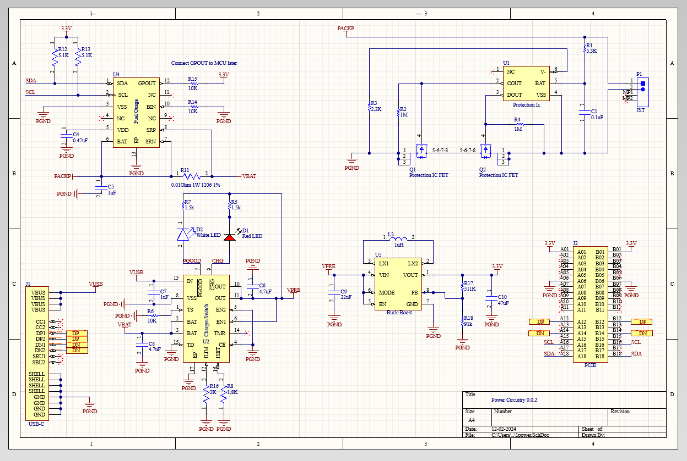

# 0.0.2

This is the power module. 0.0.2 because there was a teeny mix up with JLC.

## 0.0.2 Components

- [18650](https://old.reddit.com/r/18650masterrace/comments/qp21o8/buying_18650_batteries_start_here/) [charger](https://www.reddit.com/r/18650masterrace/comments/1gqk8iy/recommendations_for_a_battery_charger/) [datasheet](https://cdn.shopify.com/s/files/1/0481/9678/0183/files/samsung_25r_data_sheet.pdf?v=1605015771)

- [Battery protection circuit](https://www.ti.com/lit/ds/symlink/bq2970.pdf?ts=1731982692134&ref_url=https%253A%252F%252Fwww.ti.com%252Fproduct%252FBQ2970%252Fpart-details%252FBQ29700DSER)

- [Protection IC FET](https://www.ti.com/lit/ds/symlink/csd16406q3.pdf?ts=1732143396551&ref_url=https%253A%252F%252Fwww.google.com%252F)

- Charing and switching IC: [BQ2407](https://www.ti.com/lit/ds/symlink/bq24074.pdf)

- ["Fuel guage"](https://www.ti.com/lit/ds/symlink/bq27441-g1.pdf?ts=1731917229522&ref_url=https%253A%252F%252Fwww.ti.com%252Fproduct%252FBQ27441-G1%253FkeyMatch%253DBQ27441-G1A%2526tisearch%253Duniversal_search)

- [TPS63001](https://www.ti.com/lit/ds/symlink/tps63001.pdf?ts=1732948086043&ref_url=https%253A%252F%252Fwww.ti.com%252Fproduct%252FTPS63001%253Fqgpn%253Dtps63001)

- [PCIe Specs PDF](PCIe_specs.pdf) (page 92 and 136)

- [USBC](https://www.digikey.ca/en/models/9859662)

## BOM

{{ read_csv('0.0.2/BOM.csv') }}
