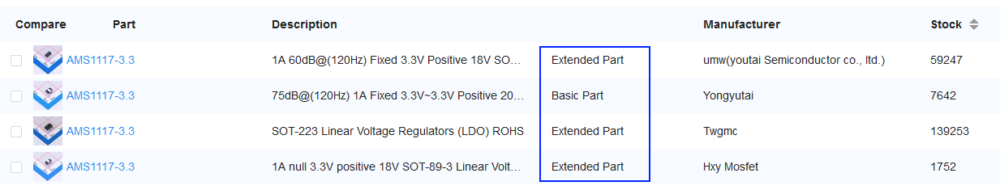
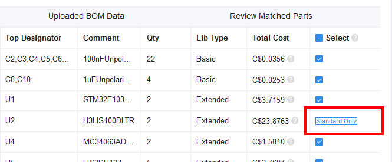
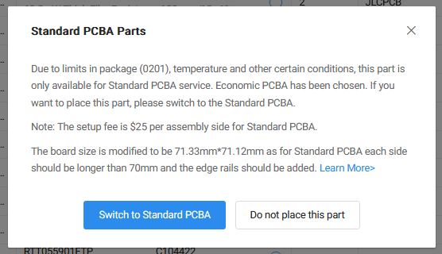
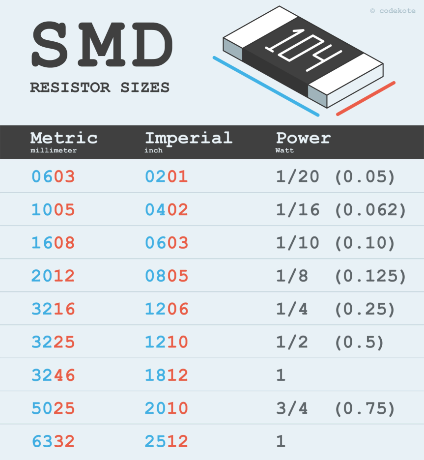
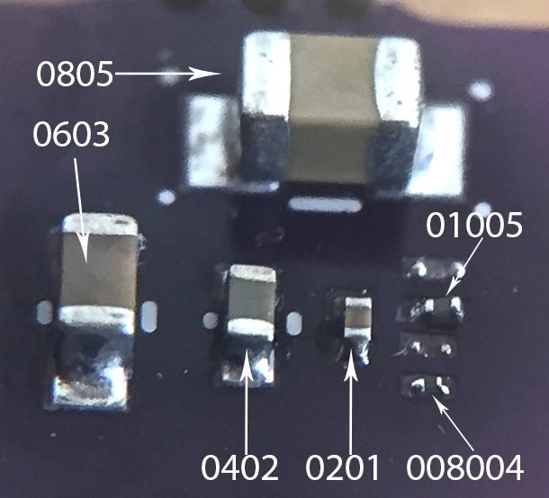
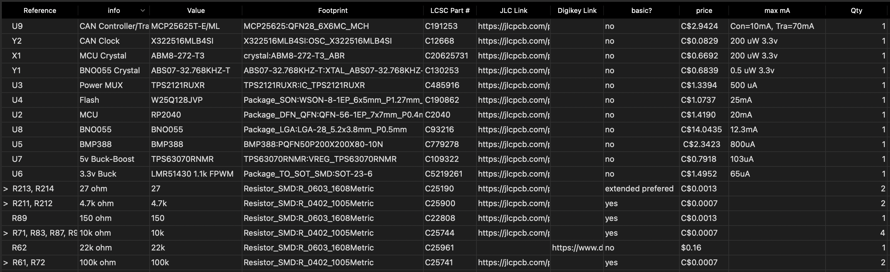
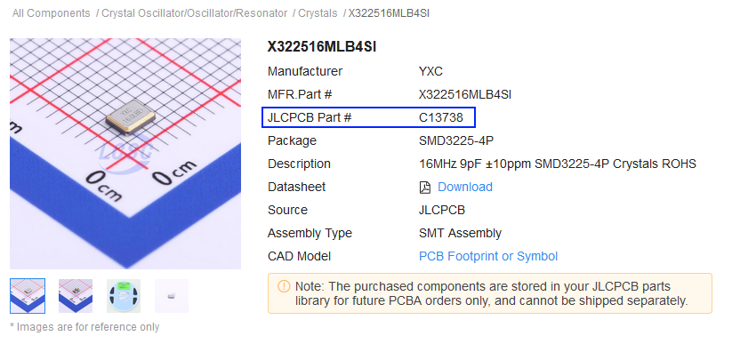

# DFM Guide

**Design for manufacturing guide.   "Forked" from [QRET](https://qret.ca/)'s component repository.**

## LCSC Part Numbers

JLCPCB is owned by LCSC, which is a large component distributor. An LCSC Part Number is a unique identifier for a given component. They will start with a “C” follow by several digits (e.g. C6186, C51230, etc.). We add these part numbers to our KiCAD schematics for parts we want assembled, and then can automatically generate a BOM (bill of material) that JLCPCB can accept. You can find these numbers on the JLCPCB page.

## JLCPCB Basic vs. Extended Parts

When searching for components through JLCPCB, they are labelled either “Basic” or “Extended”. Basic components are ones that are used very frequently, and are thus loaded into the pick-and-place machines already. Extended components are less commonly used, and thus require additional effort to load them into machines. This extra effort translates to an **additional fixed cost of ~$4.31CAD** (”Feeders Loading fee”) for every unique Extended part per batch. For standard assembly, all components have a flat Feeders Loading fee of 2.16. There are cases where using standard assembly can actually be cheaper than economic assembly such as if all your components are extended rather than basic.

 See [this page](https://jlcpcb.com/help/article/98-PCB-Assembly-FAQs) for more pricing details. We want to use Basic parts wherever possible.

[This website](https://sparks.gogo.co.nz/resistor_paralleler.html) automatically calculates the equivalent parallel or series resistor combinator to your desired resistance using only JLC basic parts.

## JLCPCB Economic vs. Standard PCB Assembly

When asking JLCPCB to solder components for us, they have two tiers; Economic and Standard. Economic comes with many benefits, largely the reduced price & option for Basic parts being free. Standard PCBA gives more options, but is more expensive (~$25 extra) and requires a loading fee for ALL components, thus resulting in a much higher price. More advanced features, such as very small components or gold-plated edge connectors, require Standard PCBA. See [this page for more info about JLCPCB’s Manufacturing and Assembly Capabilities](https://jlcpcb.com/capabilities/pcb-assembly-capabilities). We want to use the Economic option whenever possible. If “Economic” is selected, any “Standard Only” components will be highlighted after uploading the BOM during the order process. You can also use JLCPCB’s “[BOM Tool](https://jlcpcb.com/parts/bom-tool/)” to evaluate current part selection.

## Passive SMD Component Sizes

*Note: SMD is a form of SMT*.

We very commonly use the **Imperial** naming scheme when referring to passive SMD sizes.

We will be trying to avoid 0402 components where possible, to make assembly & repairs easier. 0603 and 0804 are our go-to sizes. Ideally we want to select components that JLCPCB stocks and avoid extended parts where possible.

## JLC Basic Components

I don't believe there are any basic inductors.

### Basic SMD Components (WIP)

| **Value**        | **Type**         | **Footprint** | **LCSC #**                                                                                     |
|------------------|------------------|---------------|------------------------------------------------------------------------------------------------|
| Red LED          | LED              | 0603          | [C2286](https://jlcpcb.com/partdetail/Hubei_KentoElec-KT0603R/C2286)                           |
| Red LED          | LED              | 0805          | [C84256](https://jlcpcb.com/partdetail/85425-NCD0805R1/C84256)                                 |
| White LED        | LED              | 0603          | [C2290](https://jlcpcb.com/partdetail/Hubei_KentoElec-KT0603W/C2290)                           |
| White LED        | LED              | 0805          | [C34499](https://jlcpcb.com/partdetail/Hubei_KentoElec-KT0805W/C34499)                         |
| Yellow LED       | LED              | 0603          | [C72038](https://jlcpcb.com/partdetail/73147-19_213_Y2C_CQ2R2L_3T_CY/C72038)                   |
| Yellow LED       | LED              | 0805          | [C2296](https://jlcpcb.com/partdetail/Hubei_KentoElec-KT0805Y/C2296)                           |
| Green LED        | LED              | 0805          | [C2297](https://jlcpcb.com/partdetail/Hubei_KentoElec-KT0805G/C2297)                           |
| 2N7002           | N-MOSFET         | SOT-23        | [C8545](https://jlcpcb.com/partdetail/9040-2N7002/C8545)                                       |
| AO3400A          | N-MOSFET         | SOT-23-3L     | [C20917](https://jlcpcb.com/partdetail/Alpha_OmegaSemicon-AO3400A/C20917)                      |
| AO3401A          | P-MOSFET         | SOT-23        | [C15127](https://jlcpcb.com/partdetail/Alpha_OmegaSemicon-AO3401A/C15127)                      |
| SI2301CDS        | P-MOSFET         | SOT-23        | [C10487](https://jlcpcb.com/partdetail/VishayIntertech-SI2301CDS_T1GE3/C10487)                 |
| 1N5819WS         | Schottky Diode   | SOD-323       | [C191023](https://jlcpcb.com/partdetail/GuangdongHottech-1N5819WS/C191023)                     |
| SS14             | Schottky Diode   | DO-214AC      | [C2480](https://jlcpcb.com/partdetail/Mdd-SS14/C2480)                                          |
| 1k               | Resistor         | 0805          | [C17513](https://jlcpcb.com/partdetail/18201-0805W8F1001T5E/C17513)                            |
| 10pF             | MLC Capacitor    | 0603          | [C1634](https://jlcpcb.com/partdetail/C1634)                                                   |
| 10pF             | MLC Capacitor    | 0402          | [C32949](https://jlcpcb.com/partdetail/C32949)                                                 |
| 30pF             | MLC Capacitor    | 0603          | [C1658](https://jlcpcb.com/partdetail/C1658)                                                   |
| 2.2nF            | Capacitor        | 0603          | [C1604](https://jlcpcb.com/partdetail/C1604)                                                   |
| 10nF             | MLC Capacitor    | 0603          | [C57112](https://jlcpcb.com/partdetail/C57112)                                                 |
| 10nF             | MLC Capacitor    | 0402          | [C15195](https://jlcpcb.com/partdetail/C15195)                                                 |
| 100nF            | MLC Capacitor    | 0603          | [C14663](https://jlcpcb.com/partdetail/C14663)                                                 |
| 100nF            | MLC Capacitor    | 0402          | [C1525](https://jlcpcb.com/partdetail/C1525)                                                   |
| 1uF              | MLC Capacitor    | 0805          | [C28323](https://jlcpcb.com/partdetail/C28323)                                                 |
| 1uF              | MLC Capacitor    | 0603          | [C15849](https://jlcpcb.com/partdetail/C15849)                                                 |
| 1uF              | MLC Capacitor    | 0402          | [C52923](https://jlcpcb.com/partdetail/C52923)                                                 |
| 4.7uF            | MLC Capacitor    | 0805          | [C1779](https://jlcpcb.com/partdetail/C1779)                                                   |
| 10uF             | MLC Capacitor    | 0603          | [C96446](https://jlcpcb.com/partdetail/C96446)                                                 |
| 10uF             | MLC Capacitor    | 0402          | [C15525](https://jlcpcb.com/partdetail/C15525)                                                 |
| 22uF             | MLC Capacitor    | 0805          | [C45783](https://jlcpcb.com/partdetail/C45783)                                                 |
| 100Ohm           | Ferrite Bead     | 0805          | [C1015](https://jlcpcb.com/partdetail/C1015)                                                   |
| 600Ohm           | Ferrite Bead     | 0805          | [C1017](https://jlcpcb.com/partdetail/C1017)                                                   |

### 0603 Resistors

Most of these come in 0402 basic as well.

| **Value** | **LCSC Part Number** |
| --- | --- |
| 0R | C21189 |
| 10R | C22859 |
| 20R | C22950 |
| 33R | C23140 |
| 51R | C23197 |
| 100R | C22775 |
| 120R | C22787 |
| 150R | C22808 |
| 200R | C8218 |
| 220R | C22962 |
| 270R | C22966 |
| 300R | C23025 |
| 330R | C23138 |
| 390R | C23151 |
| 470R | C23179 |
| 510R | C23193 |
| 560R | C23204 |
| 680R | C23228 |
| 820R | C23253 |
| 1k | C21190 |
| 1.2k | C22765 |
| 1.5k | C22843 |
| 1.8k | C4177 |
| 2k | C22975 |
| 2.2k | C4190 |
| 2.4k | C22940 |
| 2.7k | C13167 |
| 3.3k | C22978 |
| 3.6k | C22980 |
| 3.9k | C23018 |
| 4.7k | C23162 |
| 5.1k | C23186 |
| 5.6k | C23189 |
| 6.2k | C4260 |
| 6.8k | C23212 |
| 7.5k | C23234 |
| 8.2k | C25981 |
| 9.1k | C23260 |
| 10k | C25804 |
| 12k | C22790 |
| 13k | C22797 |
| 15k | C22809 |
| 18k | C25810 |
| 20k | C4184 |
| 22k | C31850 |
| 24k | C23352 |
| 27k | C22967 |
| 30k | C22984 |
| 33k | C4216 |
| 39k | C23153 |
| 47k | C25819 |
| 51k | C23196 |
| 56k | C23206 |
| 68k | C23231 |
| 75k | C23242 |
| 82k | C23254 |
| 100k | C25803 |
| 120k | C25808 |
| 150k | C22807 |
| 200k | C25811 |
| 220k | C22961 |
| 300k | C23024 |
| 330k | C23137 |
| 470k | C23178 |
| 510k | C23192 |

## Formatting your BOM

The following is a good BOM:

The most important thing in your BOM is the LCSC part number:

When you upload your BOM to JLCPCB it looks for the LCSC part number and matches the component automatically.

You do not need silk screen chip designators for JLCPCB assembly. You do however need to put dots on pin one of ICs, and note anything that is polarized including LEDs. Try the JLCPCB assembly [demo](https://cart.jlcpcb.com/quote?fromDemo=yes).