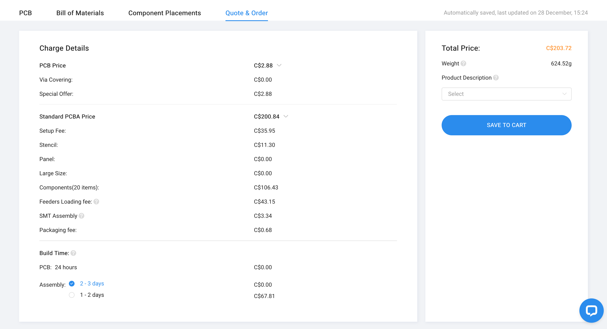

Here are two images of the final prices for PCBs

The more expensive one uses standard assembly, the less expensive one uses economic. I thought standard assembly would cost a lot more.

At first I designed the PCB with a sensors that were only available with standard assembly. It cost $205 I was like that's a little much.

Then I redesigned it with all economic components. It turned out the feeders loading fee is the exact same for both because the standard fee is half of the economic fee and I had double the components.

So in the end it costs about $50 more to use much better sensors. That's only $10 a board. I think it's well worth it.
