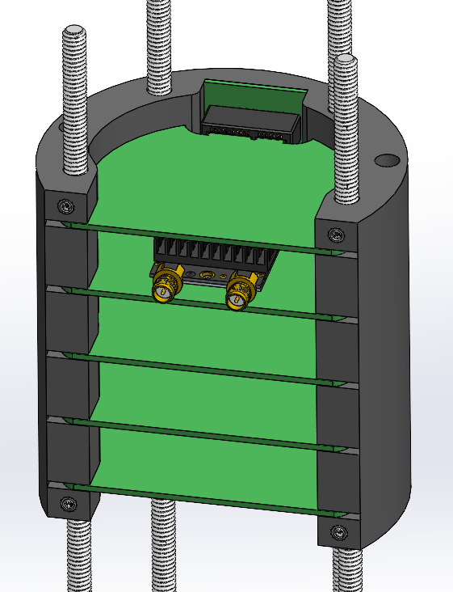
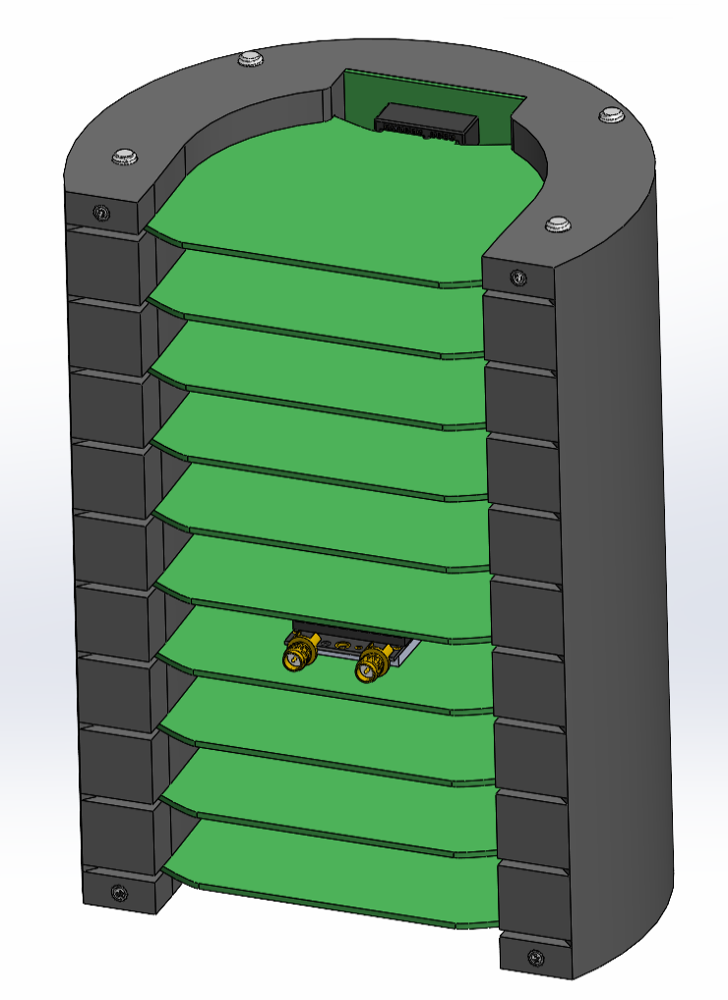
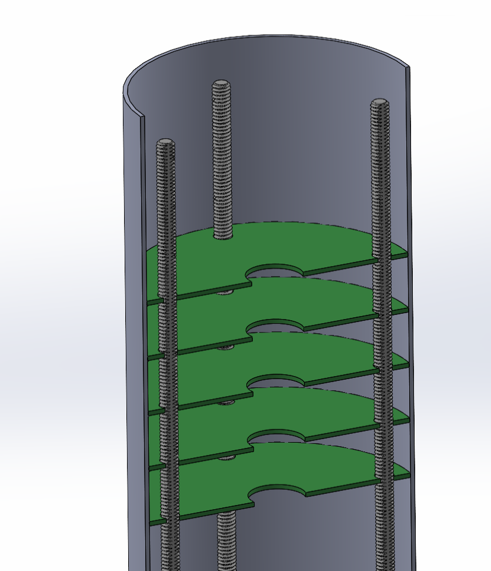

Wow, the CAD for the avionics bay took a little longer than I expected. I had to make everything easily modifiable, so I used variables for almost every dimension. With the change of a couple numbers in a text file I can go from this:

{ width="300" }

to this

{ width="300" }

This is a fun avionics layout. I think it's kinda fun how they all slot into a PCIe CAN bus. 3D printing this is gonna be weird. I could also go with this design, but I think the first one is more fun.

{ width="300" }

The thing about this avionics system, is that once the board dimensions are made, there's no going back. 

