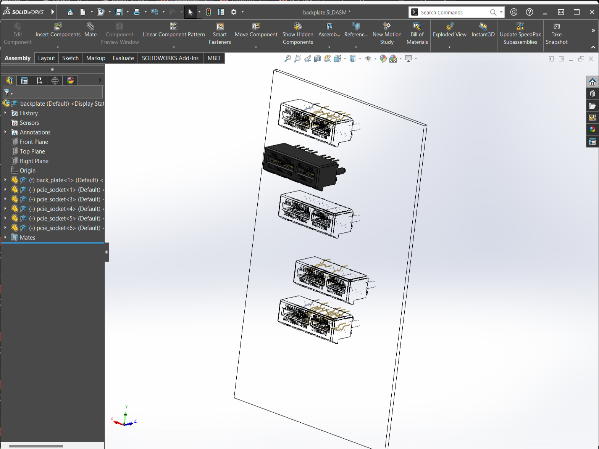
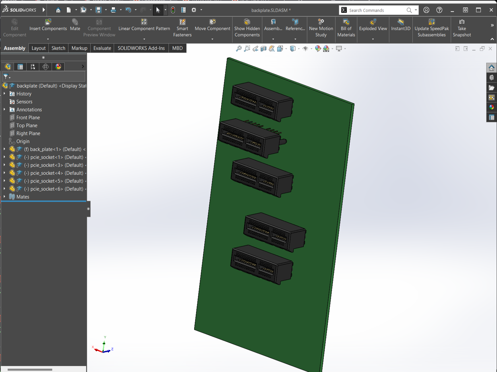

Why is Solidworks so fucked. It keeps flickering between these views:

I've had so many glitches. I've ran the import diagnostics on the PCIe step it says its fine. I did... do [the workaround](https://www.youtube.com/watch?app=desktop&v=vmbjWkmItBQ) to get my 3070ti working. Although this happens with realview on or off. 