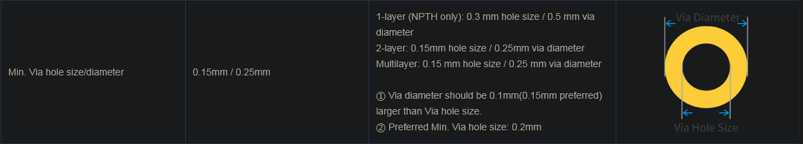
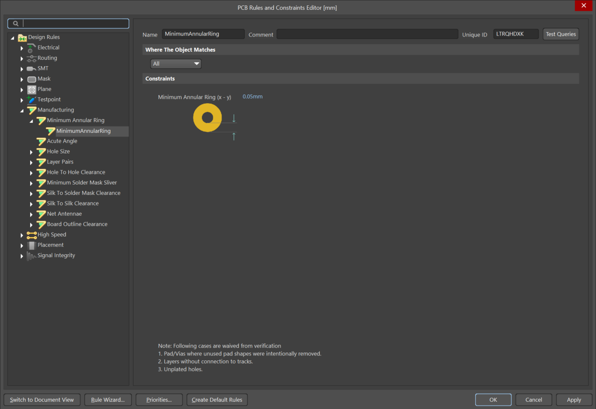

JLCPCB ["PCB Manufacturing & Assembly Capabilities"](https://jlcpcb.com/capabilities/pcb-capabilities) is kinda confusing.

So for a two layer PCB,

it says *"2-layer: 0.15mm hole size / 0.25mm via diameter."* That would mean the pad width or "annular ring" can be 0.05mm right? 

\[
\frac{0.25}{2} - \frac{0.15}{2} = 0.05
\]

but wait:

Now it says: *"2-layer: 1 oz: Recommended 0.25 mm or above; absolute minimum 0.18 mm."* 

**I guess a via doesn't count as a PTH (Plated Through Hole)?**

By default in Altium you set your minimum annular ring:

and this applies to vias and PTH. So... I guess Altium probably should't do this by default?