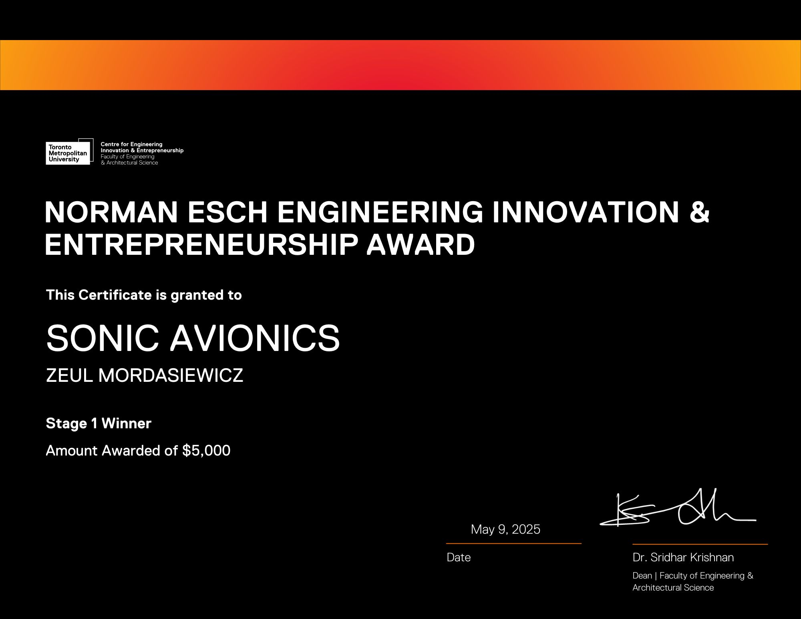
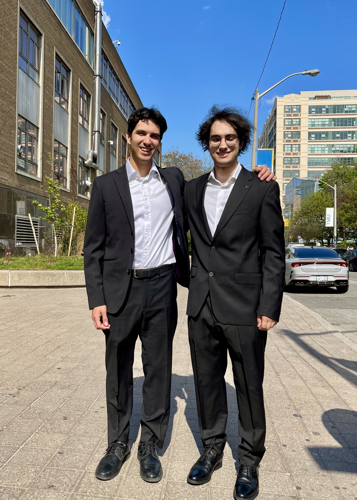
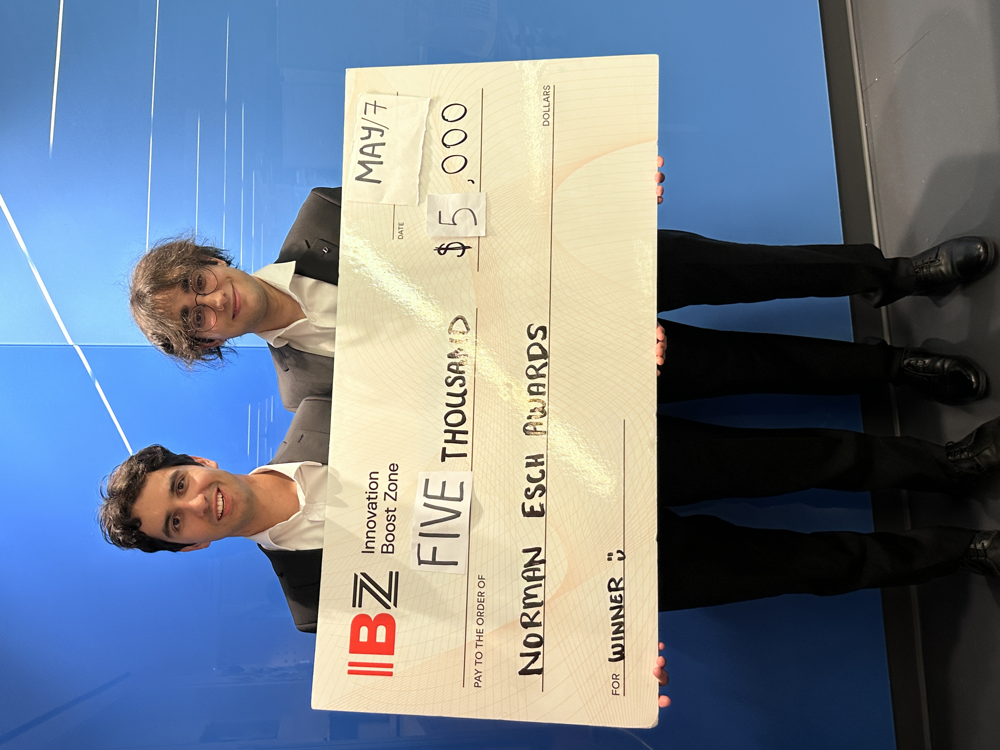

I am proud to announce that we won the stage 1 [Norman Esch Engineering Innovation and Entrepreneurship Award](https://www.torontomu.ca/ceie/eschawards/)!

    
    

    <h3>This is a test HTML block</h3>
    
This block demonstrates embedding custom HTML content in markdown.

    <ul>
        <li>Item 1</li>
        <li>Item 2</li>
        <li>Item 3</li>
    </ul>

    <h4>Interactive Elements Example</h4>
    
Here's a more complex HTML structure with additional styling:

    

        

            
Click to expand technical details

            

                
Our solution implements a novel approach to avionics using:

                <ol>
                    <li>Advanced sensor fusion algorithms</li>
                    <li>Real-time data processing</li>
                    <li>Minimal hardware footprint</li>
                </ol>
            

        

    

