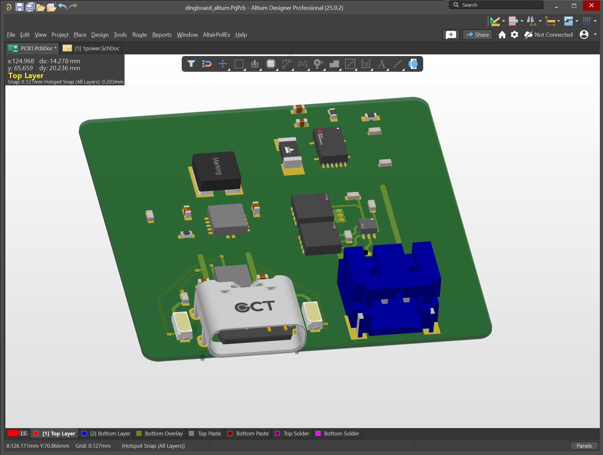

# dingboard

Simple flight computer that uses all the best practices. A good place to start.

This board is everything you would want in a passive data collection flight computer. Made for beginner model rockets. Basically a better version of [this](https://zeul.ca/projects/archive/template.php?day=6&month=6&year=2022&title=Calculating_the_Drag_Coefficient).
******

<figure markdown="span">

  { width="200" }
  <figcaption>Current progress</figcaption>

</figure>

### Initial Requirements and Design Goals
The primary goal of dingboard is to enable my personal learning.
This will be the first board of many. The successor to dingboard will be a CAN enabled system in a 4-inch diameter form factor which will hopefully be launched this summer.

Primary Functional Requirements for dingboard:

- Easy to operate and understand
- Fully open source
- Assemblable by JLCPCB PCBA
- On board charging and automatic power switching using simple chip
- Charging status indicators
- MCU status indicator, sleep, data collection etc.
- Altium and solidworks integration
- Utilize all known best practices to enable scalability
- Components:
    - Barometer
    - Accelerometer
    - Thermistor for battery protection
- Use entire safe range of battery (use a buck boost)

[Here's the link](https://github.com/zeulewan/dingboard) to the Altium project repo

### Components

#### Power

- [18650](https://old.reddit.com/r/18650masterrace/comments/qp21o8/buying_18650_batteries_start_here/) [charger](https://www.reddit.com/r/18650masterrace/comments/1gqk8iy/recommendations_for_a_battery_charger/) [datasheet](https://cdn.shopify.com/s/files/1/0481/9678/0183/files/samsung_25r_data_sheet.pdf?v=1605015771)

- [Battery protection circuit](https://www.ti.com/lit/ds/symlink/bq2970.pdf?ts=1731982692134&ref_url=https%253A%252F%252Fwww.ti.com%252Fproduct%252FBQ2970%252Fpart-details%252FBQ29700DSER)

- [Protection IC FET](https://www.ti.com/lit/ds/symlink/csd16406q3.pdf?ts=1732143396551&ref_url=https%253A%252F%252Fwww.google.com%252F)

- Charing and switching IC: [BQ2407](https://www.ti.com/lit/ds/symlink/bq24074.pdf)

- ["Fuel guage"](https://www.ti.com/lit/ds/symlink/bq27441-g1.pdf?ts=1731917229522&ref_url=https%253A%252F%252Fwww.ti.com%252Fproduct%252FBQ27441-G1%253FkeyMatch%253DBQ27441-G1A%2526tisearch%253Duniversal_search)

- [Buck-Boost](https://www.sparkfun.com/datasheets/Prototyping/tps61200.pdf)

#### Compute

- MCU: RP 2040, [Hardware design guide](https://datasheets.raspberrypi.com/rp2040/hardware-design-with-rp2040.pdf), [datasheet](https://datasheets.raspberrypi.com/rp2040/rp2040-datasheet.pdf)

- IMU: [ICM-42670](https://datasheet.octopart.com/ICM-42670-P-InvenSense-datasheet-155317655.pdf?src-supplier=Component+Distributors+Inc.)

- Barometer: [LPS22HH](https://datasheet.ciiva.com/pdfs/VipMasterIC/IC/SGST/SGST-S-A0007383744/SGST-S-A0007383744-1.pdf?src-supplier=IHS+Markit)

- Flash: [W25Q128JV](https://datasheet.ciiva.com/pdfs/VipMasterIC/IC/WBND/WBND-S-A0008390754/WBND-S-A0008390754-1.pdf?src-supplier=IHS+Markit)

- LED: Power status indicator

### Checklist (Not really relevant anymore)

- [x] Altium with GitHub
- [x] Begin PCB V1
- [ ] Complete board schematic
- [ ] Complete board layout
- [ ] Altium with Solidworks
- [ ] JLCPCB PCBA

### Misc Thoughts

- Using a single MOSFET for switching between USB and battery voltage is just too janky.
    - Shoot through voltage.
    - The way to do it simply would be by taking advantage of the "Zero Gate Voltage Drain Current", but there's a load connected to the source so the voltage probably wont rise
    - In-rush current, you need a resistor to the gate
    - Going to need more robust circuitry than this
    - Could flip the P channel enhancement mosfet to have the current go from source to drain in order to get the negative voltage, but too janky
    - Going with a BQ2407x that handles power switching and battery charging. It's basically designed for this exact thing.
- Not using RT9080. Need a buck boost. I should be able to use the entire range of battery

- Typical via sizes
    - Large: 0.7 mm pad, 0.3 mm drill
    - Medium: 0.6 mm pad, 0.25 mm drill
    - Small: 0.5 mm pad, 0.2 mm

### Video references
Good videos:

- [Altium Designer Quick-Start Tutorial with Phil Salmony from Phil's Lab](https://www.youtube.com/watch?v=YTGzncKU5RY)

- [Raspberry Pi RP2040 Hardware Design | Altium Designer | JLCPCB - Phil's Lab #28](https://www.youtube.com/watch?v=X00Cm5LMNQk)

- [How To Keep Components Connected When Moving | Altium Designer](https://www.youtube.com/watch?v=wfML_NWr2sI)