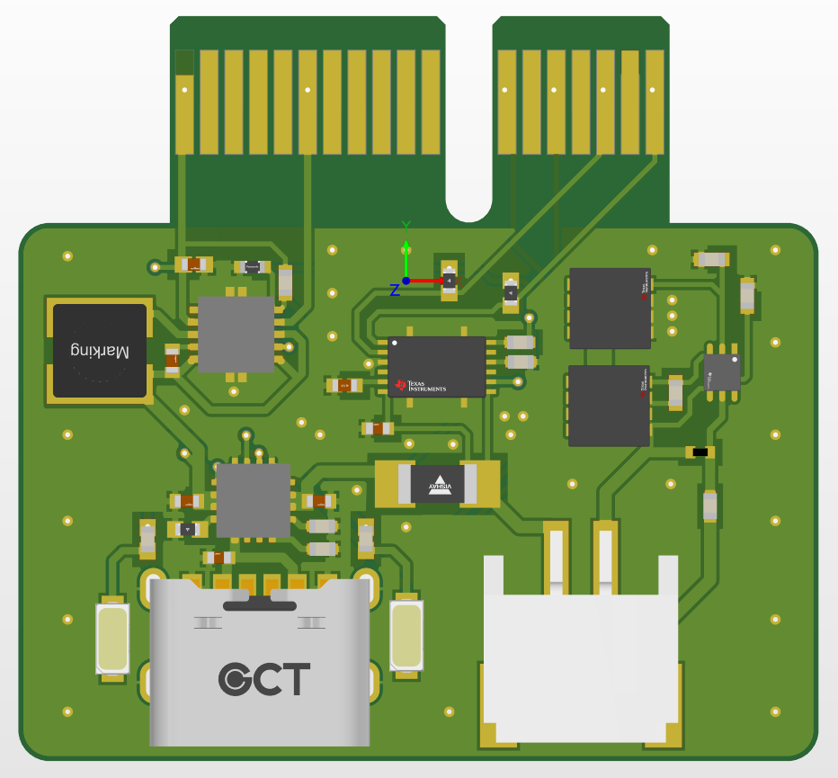

# Dingboard

Simple flight computer that uses all the best practices. A good place to start.

This board is everything you would want in a passive data collection flight computer. Made for beginner model rockets. Basically a better version of [this](https://zeul.ca/projects/archive/template.php?day=6&month=6&year=2022&title=Calculating_the_Drag_Coefficient).
******

<figure markdown="span">

  { width="600" }
  <figcaption>November 28</figcaption>

</figure>

## Initial Requirements and Design Goals
The primary goal of dingboard is to enable my personal learning.
This will be the first board of many. The successor to dingboard will be a CAN enabled system in a 4-inch diameter form factor which will hopefully be launched this summer.

Primary Functional Requirements for dingboard:

- Easy to operate and understand
- Fully open source
- Assemblable by JLCPCB PCBA
- On board charging and automatic power switching using simple chip
- Charging status indicators
- MCU status indicator, sleep, data collection etc.
- Altium and solidworks integration
- Utilize all known best practices to enable scalability
- Components:
    - Barometer
    - Accelerometer
    - Thermistor for battery protection
- Use entire safe range of battery (use a buck boost)
- Why not go with an ESP?

[Here's the link](https://github.com/zeulewan/dingboard) to the Altium project repo

## Checklist

- [x] Altium with GitHub
- [x] Begin PCB V1
- [x] Complete board schematic
- [x] solid works and altium
    - [ ] ~~set board dimensions~~ Gonna set the board dimensions after I get the first iteration of the power board ordered
- [x] get proper PCIe dimensions
- [ ] ~~add power switch for battery~~ Forget it i'll just unplug it for this version
- [x] finish routing
    - [x] buck boost
    - [x] fuel gauge 
- [ ] add test points
- [ ] add all LCSC designators
- [ ] double check all connections
- [ ] order upp
    - [ ] jlcpcb or oshpark?

## Library
I started using the [Celestial Altium Library](https://altiumlibrary.com/).
[Install video](https://www.youtube.com/watch?v=lBvwvbw83iY)

I finally found a [PCIe x1 footprint](https://www.snapeda.com/parts/PCIE-036-02-S-D-EMS3/Samtec%20Inc./view-part/). edit: should have just made it from scratch. That footprint was garbage, had to redo it.

## Video references
Good videos:

- [Altium Designer Quick-Start Tutorial with Phil Salmony from Phil's Lab](https://www.youtube.com/watch?v=YTGzncKU5RY)

- [Raspberry Pi RP2040 Hardware Design | Altium Designer | JLCPCB - Phil's Lab #28](https://www.youtube.com/watch?v=X00Cm5LMNQk)

- [How To Keep Components Connected When Moving | Altium Designer](https://www.youtube.com/watch?v=wfML_NWr2sI)

- [Microcontroller-Based Hardware Design With Altium Designer - #3 USB C ](https://www.youtube.com/watch?v=t67KcQHhIC4&list=PL3aaAq2OJU5EsYtNwTPHNO3RHNJN34FbO&index=16)

- [ECAD-MCAD CoDesign with Altium 365 & SOLIDWORKS](https://www.youtube.com/watch?v=ciPQ3UqYVuc)

- [Types of PCB Grounding Explained | PCB Layout](https://www.youtube.com/watch?v=19WnYPhNOH0)