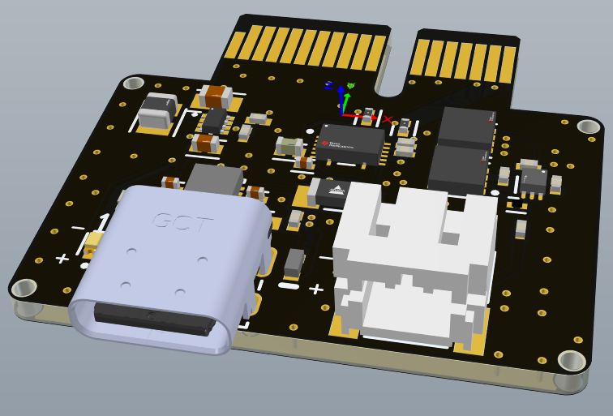

---
hide:
  - navigation
  - toc
  - title
---
# Home

This is the Sonic Avionics documentation and blog.

<!-- <figure markdown="span">

  { width="300" }
  <figcaption>Zeul</figcaption>

</figure> -->

<table style="margin: 0 auto;">
  <tr>
    <td align="center">
       
      <a href="avionics/">Power Module 0.0.2</a>
    </td>

</table>

